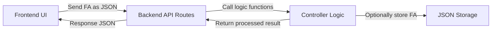
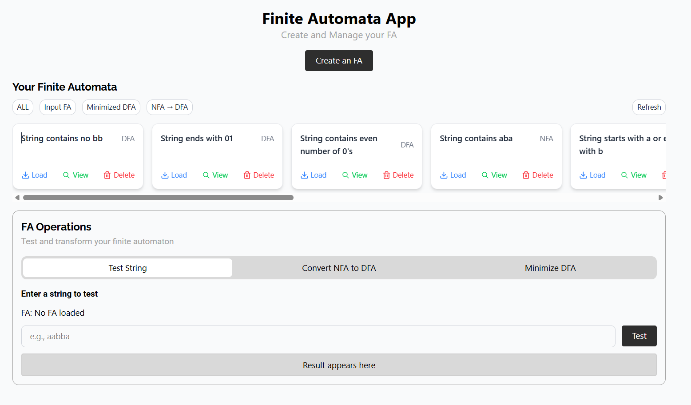
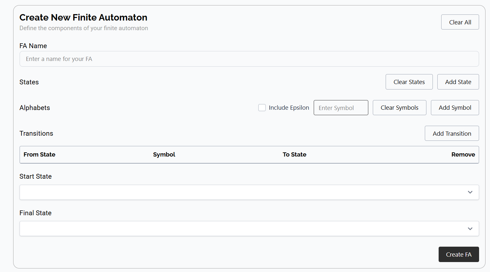

# Finite Automata Web App

- [Finite Automata Web App](#finite-automata-web-app)
  - [Project Overview](#project-overview)
    - [Features](#features)
    - [System Architecture](#system-architecture)
    - [Tech Stack](#tech-stack)
      - [Frontend](#frontend)
      - [Backend](#backend)
    - [Project Structure](#project-structure)
  - [Getting Started](#getting-started)
    - [Installation and Setup](#installation-and-setup)
  - [Demo](#demo)
  - [Contributors](#contributors)

## Project Overview

The project aims to develop a web-based application that allows users to interactively construct, test, and perform operations on finite automata. The application provides a wide range of functionalities, including constructing finite automata (both deterministic and non-deterministic), defining the type of finite automata, testing string acceptance, converting NFAs to equivalent DFAs, and minimizing DFAs.

### Features

| Feature                       | Description                                                                                                    |
| ----------------------------- | -------------------------------------------------------------------------------------------------------------- |
| **Construct Finite Automata** | Create DFAs and NFAs by defining states, alphabet, transitions, start, and accept states.                      |
| **Type Detection**            | Automatically identifies whether a constructed FA is a DFA or NFA and stores it for future use.                |
| **String Acceptance Testing** | Tests whether a given string is accepted by a selected FA.                                                     |
| **NFA to DFA Conversion**     | Converts a non-deterministic FA to its equivalent deterministic FA, showing both transition tables.            |
| **DFA Minimization**          | Minimizes a DFA by reducing it to the smallest equivalent automaton, with original and minimized tables shown. |

### System Architecture



### Tech Stack

#### Frontend

| Technology   | Figure                                                                                                                       | Detail                                                            |
| ------------ | ---------------------------------------------------------------------------------------------------------------------------- | ----------------------------------------------------------------- |
| React.js     |                 | A JavaScript library for building interfaces for web applications |
| Axios        |                        | Handles HTTP request to communicate with backend API.             |
| HTML         |                     | Structures the web page                                           |
| CSS          |                        | For styling the HTML structured.                                  |
| Tailwind CSS |  | Makes styling fast with classes and responsive design.            |

#### Backend

| Technology | Figure                                                                                                                    | Detail                                                      |
| ---------- | ------------------------------------------------------------------------------------------------------------------------- | ----------------------------------------------------------- |
| Node.js    |                    | Runs the server-side JavaScript environment.                |
| Express.js |  | A framework for Node.js, used to create RESTful API routes. |

### Project Structure

```plaintext
fa-analyzer/
├── backend/                  # Express.js server
│   ├── routes                # Route handler
│   ├── middleware            # Logging middleware
│   ├── controller            # Route logic handler
│   ├── data                  # Store all finite automata
│   ├── logic                 # Finite automata operations logic
│   ├── models
│   ├── utils                 # Utility functions
│   └── server.js             # Server entry point
├── docs                      # Documentation files
├── frontend/                 # React.js application
│   ├── public                # Store public assets
│   ├── src/
│   │   ├── api
│   │   ├── assets/
│   │   │   └── font          # Store fonts
│   │   ├── components/       # Reusable components
│   │   │   ├── common
│   │   │   ├── FaForm
│   │   │   ├── FaHistory
│   │   │   └── FaOperations
│   │   ├── context
│   │   ├── logic
│   │   ├── style
│   │   ├── App.jsx
│   │   └── main.jsx
│   └── package.json          # Dependencies
└── README.md
```

## Getting Started

### Installation and Setup

1. Clone the repository

```bash
git clone https://github.com/Leangchhay1523/automata-project
```

2. Install and run backend server

```bash
cd backend
npm install
npm run dev

```

3. Install and run frontend

```bash
cd frontend
npm install
npm run dev
```

## Demo

- Finite Automata web app
  
- Finite Automata creation form
  

## Contributors

- Ty Punleu - https://github.com/PunleuTY
- Srey Sitharath - https://github.com/Sitharath-s
- Song Kimleangchhay - https://github.com/Leangchhay1523
- Khy Pichsereyvathanak - https://github.com/PichSereyVathanak
